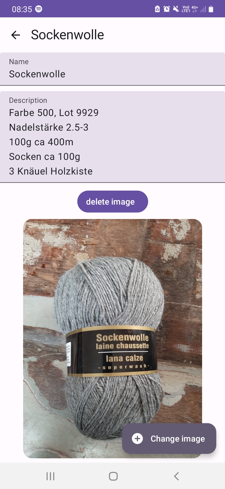

# InventoryApp

## Functionality
InventoryApp is the app for all your inventory desires.
Keep track of your inventories by category, with a base set of fields and the planned patch which offers the option of a free form fields per category feature.
Register what you need in categories you see fit and add a description and an image!

## Points
We plan to achieve the minimum score with the following features:

| Feature                                                          |Points| Planned (Notes)                                                                        |
|------------------------------------------------------------------|---|----------------------------------------------------------------------------------------|
| Verwendung von Kotlin statt Java (pro Teammitglied)              |3 * 3 = 9| X                                                                                      |
| Funktionalität (pro Funktion / Screen)                           |1 to 5| X (Fully-functional lists (categories, items), search, image capture from detail view) |
| Persistenz / Offlinefähigkeit                                    |1 to 3| X (Persist locally)                                                                    |                                                                                 |
| Verwendung von Webservices                                       |1 to 3||
| Verwendung von Notifications                                     |1 to 2||
| Verwendung von Aktoren oder Sensoren (pro Typ)                   |1 to 2| X (Use of built-in camera)                                                             |
| Ressourcen: Lokalisierung                                        |1 to 2||
| Ressourcen: Unterschiedliche Layouts pro Gerätetyp               |1 to 3|                                                                                        |
| Ressourcen: Unterschiedliche Styles (z.B. Dark-Theme)            |1 to 2| X (Dark- and light-theme according to device's system settings)                        |
| Verwendung der 2D- und/oder 3D-APIs                              |1 to 3||
| Verwendung von Services, Broadcast Receivers, etc.               |1 to 3||
| Verwendung von Jetpack-Komponenten (pro Typ)                     |1 to 3| X (Use of Jetpack Components)                                                          |
| Integration von Drittkomponenten (Libraries)                     |1 to 3||
| Erstellung eines App Widgets (Home Screen)                       |1 to 3||
| Unterstützung einer zusätzlichen Plattform (WearOS, TV, Auto, …) |1 to 5||
| … ihre eigenen Ideen …                                           |1 to N| X (Create own app icon)                                                                |

## Screenshots

|  |  |  |
| -- | -- | -- |
|  |  |
|  |
|  |  |
|  |
|  |  |
|  |
|  |  |
|  |

